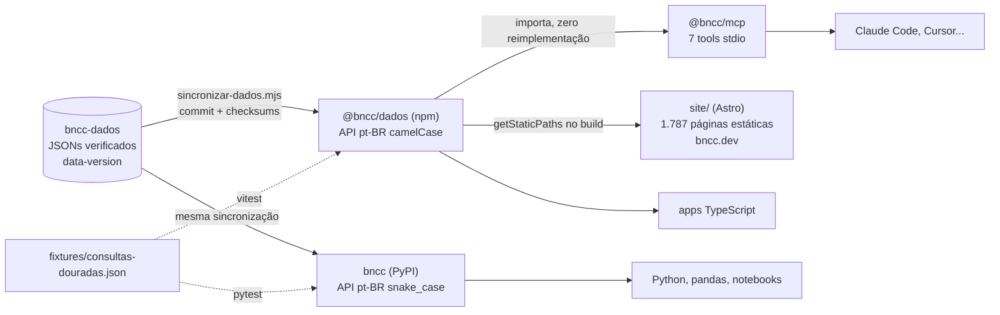

# Arquitetura do bncc-pacotes

Como as interfaces para máquina do bncc.dev se organizam, e por que assim.

## O desenho em uma frase

Uma única fonte de dados (bncc-dados), embutida de forma pinada em dois pacotes irmãos (npm e PyPI) que provam equivalência por fixtures compartilhadas, e um servidor MCP que é casca fina sobre o pacote npm.



## Princípios (herdados do projeto, aplicados aqui)

1. **Dado nunca flutua.** Os JSONs embutidos vêm de um commit específico do bncc-dados, com data-version e checksums registrados em `dados/VERSAO.json` de cada pacote. O script `scripts/sincronizar-dados.mjs` recusa checkout sujo. Ninguém edita `dados/` à mão.
2. **Uma implementação de consulta por runtime, nunca duas no mesmo.** O MCP importa o `@bncc/dados`; handlers têm ~5 linhas. A duplicação inevitável (npm vs PyPI, runtimes diferentes) é vigiada pelo contrato de paridade (ver `docs/paridade.md`).
3. **Zero dependências de runtime no pacote de dados.** O `@bncc/dados` usa só Node stdlib; o `bncc` (PyPI) só stdlib Python (pandas é extra opcional). O MCP depende apenas do SDK oficial + zod.
4. **API em português.** Decisão de produto (público dev BR, dado em pt-BR): `porCodigo()` no npm, `por_codigo()` no PyPI. A mesma semântica, a convenção de cada ecossistema.
5. **Erros ensinam.** Código inexistente responde "a numeração da BNCC tem lacunas legítimas" em vez de null silencioso. Anti-alucinação é requisito, não detalhe.

## Os três pacotes

### `packages/bncc` → npm `@bncc/dados`

- TypeScript, build tsup (ESM + CJS + `.d.ts`), dados como arquivos JSON no tarball (204 KB).
- Camadas internas: `nucleo.ts` (núcleo injetável: `criarConsultas(dados)` com índices + toda a lógica de consulta, zero fs), `consultas.ts` (casca fs: carrega os JSONs embutidos e delega), `decodificar.ts` (port do `pipeline/codigos.py` do bncc-dados), `tipos.ts` (espelho manual dos JSON Schemas).
- Subpaths exportados desde a 0.2.0: `@bncc/dados/nucleo` e `@bncc/dados/dados/*.json`, para runtimes sem sistema de arquivos (Cloudflare Workers: é como o bncc-api consome o pacote).
- Superfície: `porCodigo`, `decodificar`, `habilidadesEF/EM`, `objetivosEI`, `buscar`, `progressaoEI`, `estrutura`, `estatisticas`, `versao`.

### `packages/mcp` → npm `@bncc/mcp`

- `@modelcontextprotocol/sdk` (stdio) + `zod@^3` (linha suportada pelo SDK; não usar zod 4).
- 7 tools; 4 nomes convergem com o bncc-mcp pioneiro (dfdb76): `bncc_lookup`, `bncc_buscar`, `bncc_listar`, `bncc_estatisticas`; 3 são nossas: `bncc_decodificar`, `bncc_progressao_ei`, `bncc_estrutura`.
- Decisões de formato: respostas JSON estruturado; listagens sempre com `limite` (default) + `total` para não inundar o contexto do agente; `fonte` presente em todo registro completo; erros com `isError` e mensagem pedagógica; `instructions` do servidor carregam o resumo do domínio.
- Sem camada Mapa de Foco (licença CC BY-NC do Instituto Reúna).

### `python/` → PyPI `bncc`

- Hatchling, wheel de 208 KB, `requires-python >= 3.10`.
- Camadas espelho: `_indice.py`, `_codigos.py` (cópia adaptada do pipeline do bncc-dados), `_consultas.py`, `_pandas.py` (extra opcional).
- Registros como dicts snake_case com a mesma semântica dos objetos do npm.

## Fluxo de versão

```
bncc-dados release dados-AAAA.MM
        │  node scripts/sincronizar-dados.mjs ~/caminho/bncc-dados
        ▼
dados/ atualizados nos dois pacotes (VERSAO.json registra commit+checksums)
        │  pnpm -r test && (cd python && uv run pytest)
        ▼
bump de versão dos pacotes (minor para dado novo) → publicação
```

Mapeamento de versões: a versão do pacote segue semver próprio; a data-version dos dados embutidos é sempre consultável em runtime via `versao()`. O README de cada release declara qual data-version embute.

## Gate de publicação

O marco `1.0.0` não sai antes da release `dados-v1.0.0` do bncc-dados (revisão pedagógica registrada). Pré-releases publicadas em 09/07/2026: npm `@bncc/dados@0.1.0` e `@bncc/mcp@0.1.1` (o 0.1.0 do MCP foi depreciado: publicado com npm publish sem conversão do workspace); PyPI `bncc 0.1.0`.

### `site/` → bncc.dev (páginas canônicas)

- Astro 5, geração 100% estática no build: 1.787 páginas (1.580 aprendizagens + 105 competências específicas + navegação por etapa/componente/ano/área/campo + busca + api + índices), 97 CSVs de listagem (mesmas colunas dos derivados do bncc-dados) e o índice de busca client-side (`/buscar-indice.json`). JS mínimo inline (~4 KB: tema, decoder, tabs, copiar e busca com sugestões ao vivo no topbar e na home, sobre o índice carregado sob demanda) + o script da página /buscar/ (busca client-side com filtros; troca para a API hospedada via constante no lançamento).
- Consome o `@bncc/dados` via workspace (dogfooding: o site é o primeiro consumidor real do pacote), sempre através da camada `src/lib/dados.ts`. O pacote fica `ssr.external` no Vite porque carrega os JSONs relativos ao próprio módulo.
- Design system dos mocks aprovados do projeto (GitHub-ish, accent verde, temas claro/escuro com botão + localStorage). Página de aprendizagem com decodificador interativo, relacionadas por objeto/prática/competência, tabs "Para máquinas" (JSON real, npm, Python, MCP), sidebar de proveniência (planilha + página do PDF + DECISOES), reportar erro e citar. JSON-LD LearningResource, sitemap, llms.txt.
- Selo de verificação com a página do PDF homologado em cada página: a credibilidade como elemento de interface.
- Deploy acontece na release (Cloudflare Pages); extração para repo próprio quando o pacote for publicado. Detalhes: `site/README.md`.

## O que fica fora deste repo

- Extração e validação dos dados: bncc-dados.
- API hospedada: repo bncc-api (Fase 4, em construção; consome `@bncc/dados/nucleo`).
